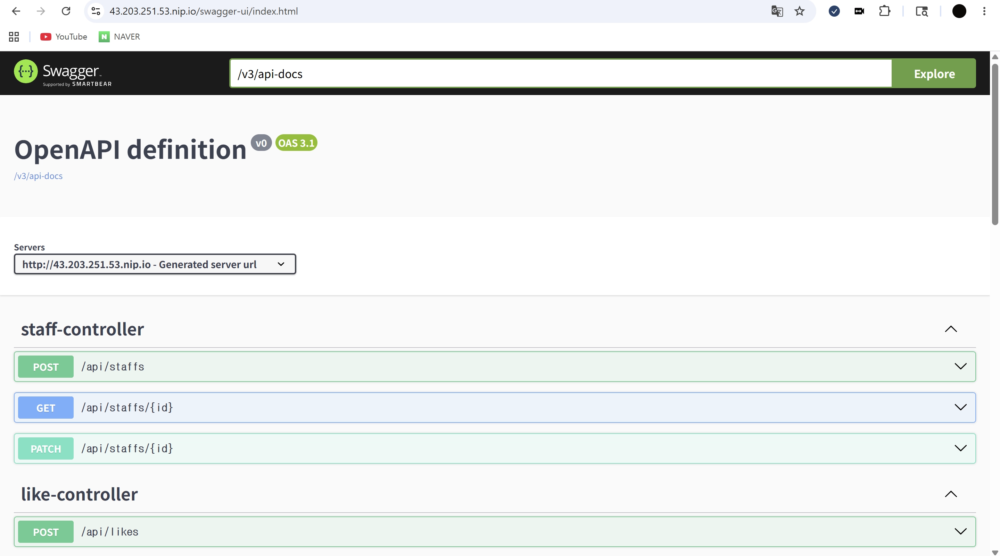
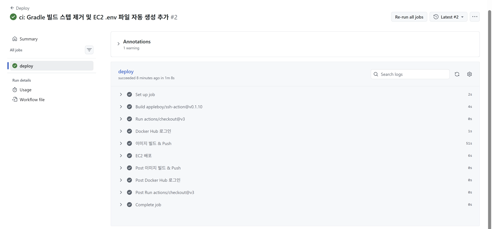

## **1. 아키텍처 다이어그램**

## 사용자 요청 흐름
- 사용자 (브라우저)  
  ↓
- https://43.203.251.53.nip.io  
  ↓
- **Nginx (80/443 포트)**
    - HTTP → HTTPS 리다이렉트
    - Let's Encrypt SSL 인증서 적용
    - 리버스 프록시 (8080 전달)  
      ↓
- **Spring Boot 컨테이너** (`cotato_app`, 8080 포트)  
  ↓
- **MySQL 컨테이너** (`cotato_db`, 3306 포트)
    - Docker Volume (`mysql_data`) 으로 데이터 영속성 보장

---

## CI/CD 배포 흐름
- networking-2 브랜치 Push  
  ↓
- **GitHub Actions 실행**
    - Docker Hub 로그인
    - Dockerfile 기반 이미지 빌드
    - Docker Hub에 이미지 Push  
      ↓
- **EC2 SSH 접속** (`appleboy/ssh-action`)
    - GitHub Secrets에서 환경변수 생성
    - Docker Hub에서 최신 이미지 Pull
    - `docker compose up -d` 실행  
      ↓
- **EC2 서버 (Ubuntu 24.04, t2.small)**
    - Nginx
    - `cotato_app` 컨테이너 (Spring Boot)
    - `cotato_db` 컨테이너 (MySQL 8.0)

---

## 전체 아키텍처
- **GitHub Repository**  
  ↓ push
- **GitHub Actions** ───────────────→ **Docker Hub**  
  │                                   (이미지 저장)  
  │ SSH 접속                          │  
  ↓                                   │ pull
- **EC2 서버 (43.203.251.53)**  ←────────────┘
    - Nginx (80/443)
        - SSL 인증서 (Let's Encrypt)
    - Spring Boot 컨테이너 (:8080)
    - MySQL 컨테이너 (:3306)
    - Volume (`mysql_data`)


## **2. 배포 URL**

실제로 접속 가능한 배포 URL

```
https://43.203.251.53.nip.io
```

Swagger 접속 URL

```
https://43.203.251.53.nip.io/swagger-ui/index.html
```

---

## **3. 배포된 Swagger 접속 화면 캡처**


```
https://43.203.251.53.nip.io/swagger-ui/index.html
```




---

## **4. GitHub Actions 성공 화면 캡처**



---

## **5. Dockerfile / Nginx 설정 내용**

### Dockerfile

멀티 스테이지 빌드 방식을 사용

```dockerfile
FROM eclipse-temurin:17-jdk-alpine AS builder
WORKDIR /app
COPY gradlew .
COPY gradle gradle
COPY build.gradle .
COPY settings.gradle .
COPY src src
RUN chmod +x gradlew && ./gradlew bootJar -x test --no-daemon

FROM eclipse-temurin:17-jre-alpine
WORKDIR /app
COPY --from=builder /app/build/libs/*.jar app.jar
ENTRYPOINT ["java", "-jar", "app.jar"]
```

**빌드 단계 (builder)**
- JDK 이미지에서 소스코드를 복사하고 Gradle로 jar 파일을 빌드합니다.
- 테스트는 생략(-x test)하고 데몬 없이 실행(--no-daemon)합니다.

**실행 단계**
- JRE만 포함된 가벼운 이미지에 jar 파일만 복사해 실행합니다.
- 최종 이미지에 빌드 도구(JDK, Gradle)가 포함되지 않아 이미지 크기를 줄입니다.

---

### Nginx 설정

```nginx
server {
    listen 80;
    server_name 43.203.251.53.nip.io;

    location / {
        proxy_pass http://127.0.0.1:8080;
        proxy_set_header Host $host;
        proxy_set_header X-Real-IP $remote_addr;
        proxy_set_header X-Forwarded-For $proxy_add_x_forwarded_for;
        proxy_set_header X-Forwarded-Proto $scheme;
    }
}
```

- 80 포트로 들어오는 요청을 Spring Boot(8080)로 전달합니다.
- Certbot으로 HTTPS 인증서 발급 후 HTTP → HTTPS 리다이렉트가 자동 적용됩니다.
- `.nip.io` 도메인을 사용해 별도 도메인 구매 없이 HTTPS를 적용했습니다.

## *6. 트러블슈팅 노트*

## 1. gradlew Permission Denied 에러 트러블슈팅

### 문제 상황
GitHub Actions 실행 흐름:
1. Actions 실행
2. `ubuntu-latest` 서버에서 워크플로우 수행
3. `git clone`으로 코드 가져옴
4. `./gradlew build` 실행
5.  **Permission denied 에러 발생**

---

### 원인
`gradlew` 파일은 **실행 권한(`x`)**이 필요합니다.  
하지만 `git push` → `git clone` 과정에서 **파일 실행 권한이 사라질 수 있습니다.**

- 로컬에서는 권한 있음 ✅
- GitHub Actions에서 clone 후 권한 없음 ❌

---

### 해결 방법

### 방법 1: 실행 권한 부여
워크플로우 내 빌드 스텝 전에 다음 명령 추가:
```bash
chmod +x gradlew
```
### 방법 2. Build 스텝 자체를 삭제 (Dockerfile에서 빌드)
Dockerfile에 이미 ./gradlew bootJar 있으므로 Actions에서 따로 빌드할 필요가 없음 -> 스텝 삭제

### 방법 2를 통해 해결

---

## 2. EC2 서버 반복 멈춤 문제 트러블슈팅

### 문제 상황
- `docker compose up` 실행 후 패키지 설치 또는 GitHub Actions 배포 중
- EC2 서버가 응답하지 않고 SSH 접속 불가능 상태 발생

---

### 원인
- 사용 인스턴스: **t2.micro (1 vCPU, 1GB 메모리)**
- 리소스 부족으로 인한 서버 멈춤 현상 발생
- t2.micro는 **CPU 크레딧 방식**으로 동작 → 일정 시간 이상 CPU 과도 사용 시 서버 정지
- CloudWatch 모니터링 결과: 배포 작업 중 CPU 사용률 **97.6%**까지 치솟음
- Spring Boot 컨테이너 + MySQL 컨테이너 실행 중에 패키지 설치나 Docker 이미지 빌드가 겹치면서 리소스 한계 도달

---

### 해결 방법
- EC2 인스턴스 유형을 **t2.micro → t2.small (1 vCPU, 2GB 메모리)**로 변경
- 메모리가 2배로 늘어나 컨테이너 실행과 배포 작업을 동시에 처리 가능해짐

---

### 인스턴스 유형 변경 절차
1. EC2 인스턴스 **중지**
2. **작업 → 인스턴스 설정 → 인스턴스 유형 변경**
3. `t2.small` 선택 후 저장
4. 인스턴스 **재시작**

---
